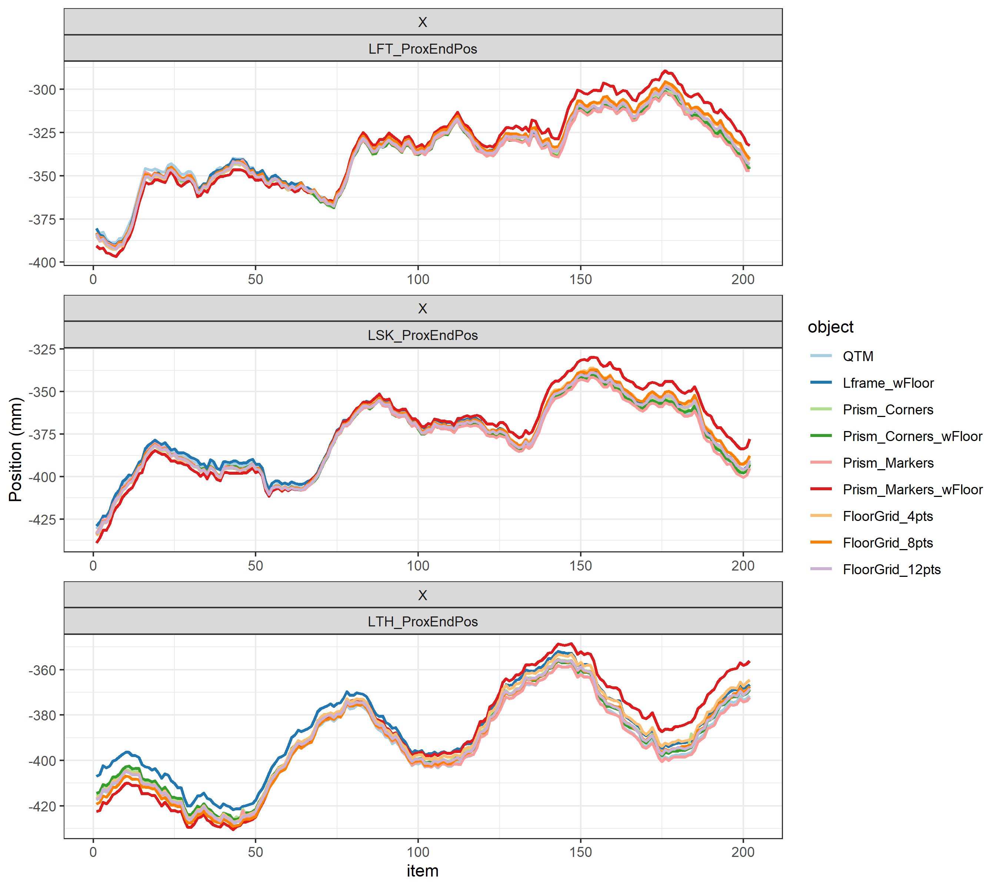
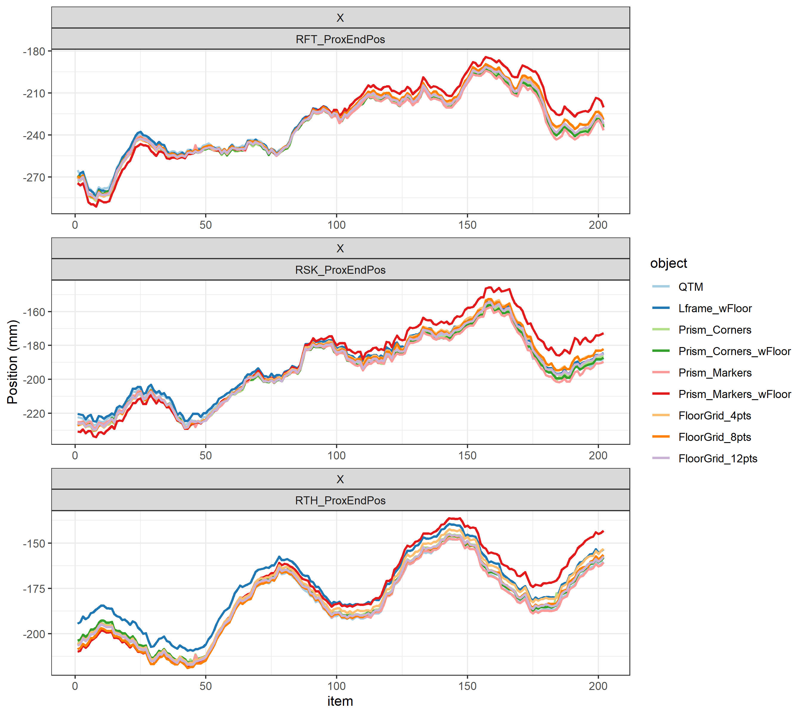
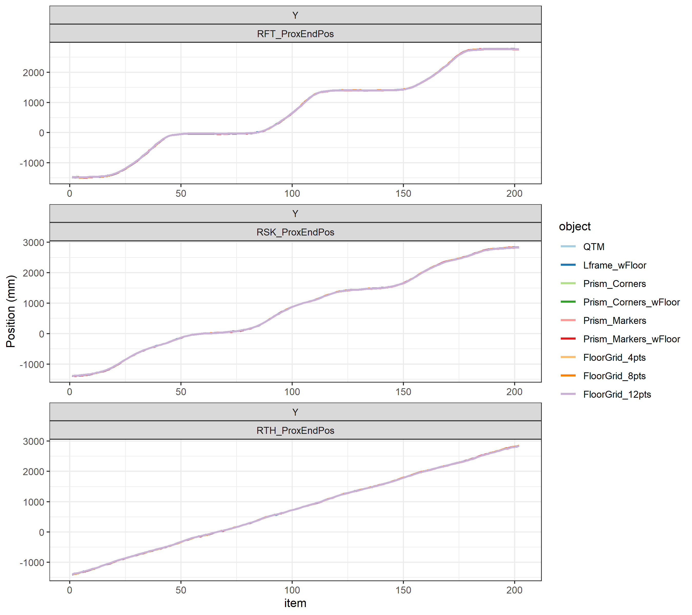
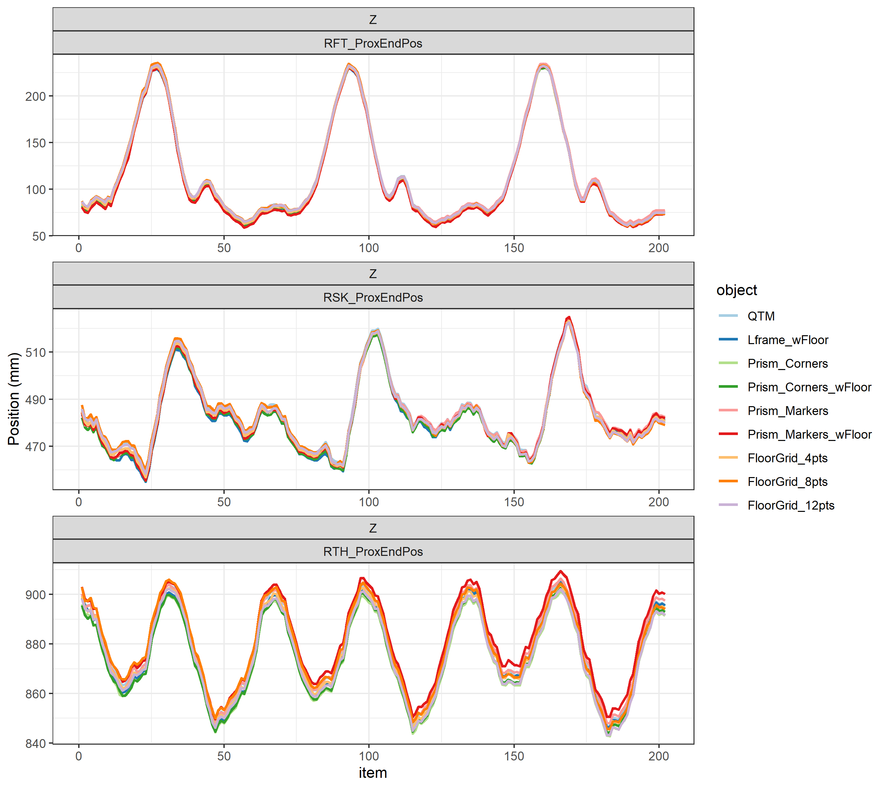
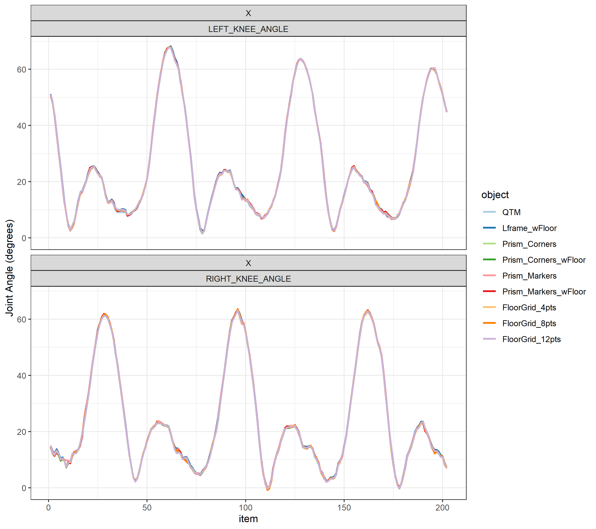
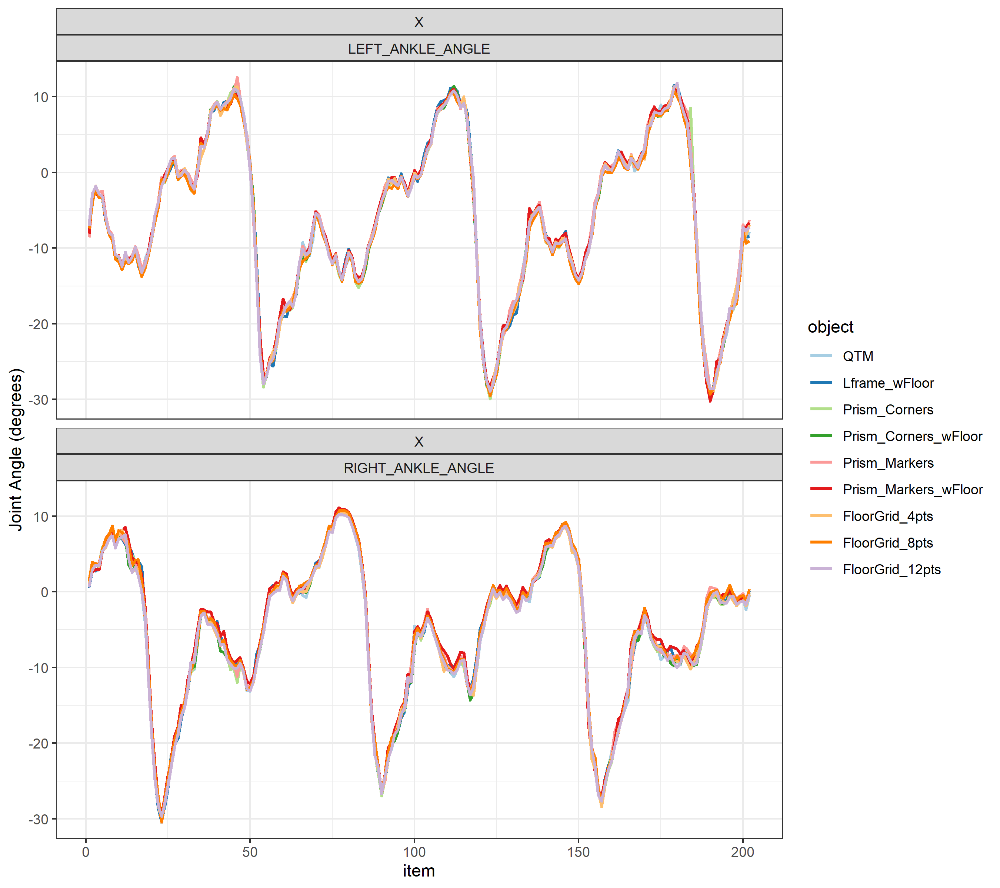
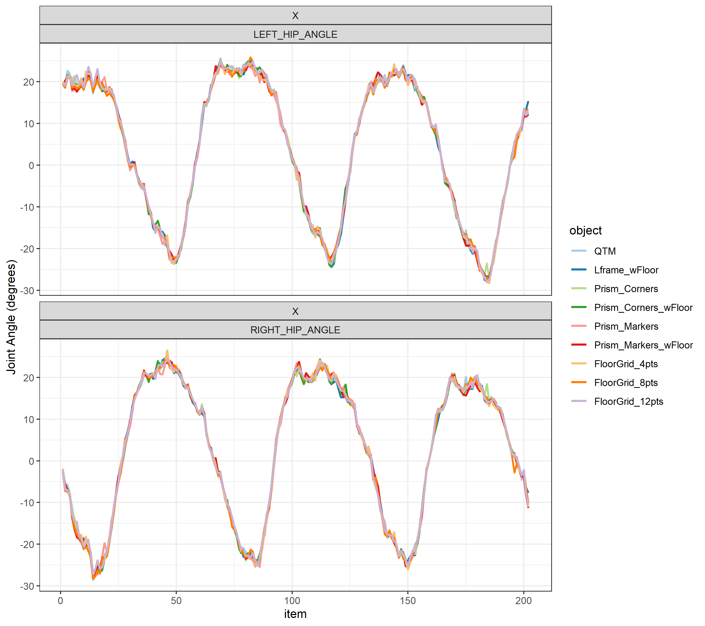

Theia3D Registration Object and its Effect on Joint Positions and Angles
================
Jereme Outerleys and Robert Kanko  
Last compiled on 2021-11-08

# Objective

Investigate the sensitivity of registration object on Theia3D
biomechanical data. The practical goal is to understand how many points
and what object configurations could be used in future collection
scenarios.

## Summary

Based on the data presented, using points situated on the ground plane
serves as a good calibration object for camera extrinsics and is
comparable to using a 3D structure or prism. This is likely due to the
increased visibility of the points making them easier to select in
Theia3D – but also, it’s easier to cover a larger space as compared to a
small to medium size 3D calibration structure. Using floord points is
useful if semi-permanent calibration points can be located on the ground
or floor of the collection volume. As a result, any video-set can be
used to perform registration. This may not be advised, however, if the
ground/floor is not flat. If needing to use a larger 3D object - it is
advised to place markers on it that are highly visible. The corners of
the object are hard to select at far distances.

Please note this is different than what is required for lens calibration
(i.e., camera intrinsic). A chessboard is required for camera intrinsic.

# Experimental Design

8 Qualisys Miqus video cameras collecting video data at 85 Hz.

The Miqus were first calibrated and registered using the Qualisys wand
and L-Frame process in combination with 11 Oqus cameras. This served as
the “reference” registration condition. We assume that the
optoelectronic process is gold standard in terms of calibration and
localizing the origin (as opposed to clicking points in Theia3D). This
process also provides access to the instrinsic parameters of the Miqus.
The Miqus intrinsics were first loaded in to Theia3D before any object
calibraion was performed.

Nine registration objects were tested, the first being the QTM L-Frame
(4 passive marker points attached to the L-Frame) as registered through
QTM. The next 8 objects were registered using Theia3D by clicking the
required registration points as defined in the object definition files
(which were made by us):

1.  **QTM**: L-Frame as registered by through QTM - i.e. reference
2.  **Lframe\_wFloor**: The Qualisys L-Frame with 4 additional points on
    the lab floor.
3.  **Prism\_Corners**: The corners of the prism.
4.  **Prism\_Corners\_wFloor**: The corners of the prism along with 4
    additional points on the lab floor.
5.  **Prism\_Markers**: Motion capture markers attached to the midpoints
    on the Prism extrustion.
6.  **Prism\_Markers\_wFloor**: Motion capture markers attached to the
    midpoints on the Prism extrustion along with 4 additional points on
    the lab floor.
7.  **FloorGrid\_4pts**: 4 points on the lab floor.
8.  **FloorGrid\_8pts**: 8 points on the lab floor.
9.  **FloorGrid\_12pts**: 12 points on the lab floor.

A: Lframe with Floor Points. B:Prism Corners with Floor Points. C:Prism
Markers with Floor Points. D: FloorGrid 12pts.

**Note**: for the Prism (corners or markers) and floor points - the
coordinates of the clicked points were held constant for each
registration process. For example, the same 4 floor point coordinates
were used for condition 4, 6,and 7 above and not “re-clicked”. These
point locations located in the Theia3D program data folder.

The same walking trial was then processed using each registration
object. The unfiltered pose data was used.

3D joint positions were extracted for all segments predicted by Theia3D.
The X, Y and Z coordinate waveforms for the ankle, knee and hip joint
positions were visualized. The 3D euclidean distance was also calculated
between the QTM object (reference). The root mean squared (RMS)
difference between each of the 8 Theia3D registered objects and the QTM
registered object was then calculated for each coordinate and the 3D
magnitude. This was also performed for joint angles of the ankle, knee
and hip.

# Joint Positions

## Left Ankle, Knee and Hip Joint

## Right Ankle, Knee and Hip Joint

# Root Mean Squared Difference with QTM L-Frame Registration

## Root Mean Squared Difference of X-Component (mm)

| object                 |  LFT |  LSK |  LTH |  RFT |  RSK |  RTH | Mean |
|:-----------------------|-----:|-----:|-----:|-----:|-----:|-----:|-----:|
| Lframe\_wFloor         | 1.39 | 2.11 | 6.32 | 1.21 | 2.66 | 8.09 | 3.63 |
| Prism\_Corners         | 2.73 | 1.79 | 2.46 | 2.49 | 1.81 | 2.21 | 2.25 |
| Prism\_Corners\_wFloor | 2.35 | 1.33 | 2.14 | 2.12 | 1.35 | 1.83 | 1.85 |
| Prism\_Markers         | 2.25 | 1.77 | 0.76 | 2.54 | 1.69 | 0.75 | 1.63 |
| Prism\_Markers\_wFloor | 6.98 | 7.58 | 7.83 | 7.47 | 8.26 | 9.05 | 7.86 |
| FloorGrid\_4pts        | 2.64 | 2.94 | 3.98 | 2.83 | 3.06 | 4.01 | 3.24 |
| FloorGrid\_8pts        | 2.59 | 2.83 | 2.07 | 2.72 | 2.89 | 1.95 | 2.51 |
| FloorGrid\_12pts       | 2.07 | 1.94 | 1.99 | 2.03 | 1.80 | 1.70 | 1.92 |

## Root Mean Squared Difference of Y-Component (mm)

| object                 |  LFT |  LSK |  LTH |  RFT |  RSK |  RTH | Mean |
|:-----------------------|-----:|-----:|-----:|-----:|-----:|-----:|-----:|
| Lframe\_wFloor         | 1.58 | 1.57 | 1.86 | 1.63 | 1.32 | 2.25 | 1.70 |
| Prism\_Corners         | 2.10 | 2.47 | 3.04 | 2.57 | 2.63 | 2.97 | 2.63 |
| Prism\_Corners\_wFloor | 2.24 | 2.27 | 2.81 | 2.45 | 2.38 | 2.63 | 2.46 |
| Prism\_Markers         | 3.98 | 3.83 | 3.83 | 4.72 | 3.78 | 4.46 | 4.10 |
| Prism\_Markers\_wFloor | 1.93 | 2.19 | 2.26 | 2.62 | 2.11 | 2.63 | 2.29 |
| FloorGrid\_4pts        | 1.01 | 0.93 | 1.14 | 1.33 | 1.30 | 1.40 | 1.18 |
| FloorGrid\_8pts        | 0.90 | 0.76 | 0.90 | 1.00 | 0.78 | 1.13 | 0.91 |
| FloorGrid\_12pts       | 2.22 | 2.32 | 2.53 | 2.64 | 2.68 | 2.63 | 2.50 |

## Root Mean Squared Difference of Z-Component (mm)

| object                 |  LFT |  LSK |  LTH |  RFT |  RSK |  RTH | Mean |
|:-----------------------|-----:|-----:|-----:|-----:|-----:|-----:|-----:|
| Lframe\_wFloor         | 2.82 | 1.71 | 1.18 | 3.67 | 2.84 | 2.01 | 2.37 |
| Prism\_Corners         | 1.97 | 2.27 | 2.56 | 2.65 | 1.94 | 4.13 | 2.59 |
| Prism\_Corners\_wFloor | 2.26 | 2.54 | 2.25 | 3.06 | 2.69 | 3.48 | 2.71 |
| Prism\_Markers         | 0.86 | 0.95 | 0.76 | 0.80 | 0.98 | 1.00 | 0.89 |
| Prism\_Markers\_wFloor | 3.22 | 1.39 | 2.41 | 4.79 | 1.83 | 2.94 | 2.76 |
| FloorGrid\_4pts        | 1.87 | 1.25 | 0.80 | 2.14 | 1.52 | 1.49 | 1.51 |
| FloorGrid\_8pts        | 1.51 | 1.13 | 1.26 | 1.62 | 1.58 | 1.49 | 1.43 |
| FloorGrid\_12pts       | 0.84 | 0.93 | 1.54 | 1.15 | 1.31 | 2.90 | 1.44 |

## Root Mean Squared Difference of 3D Euclidean (mm)

| object                 |  LAR |  LFA |  LFT |  LHA |  LSK |  LTH |  LTO |  RAR |  RFA |  RFT |  RHA |   RHE |  RPV |  RSK |  RTH |  RTO |  RTX | Mean |
|:-----------------------|-----:|-----:|-----:|-----:|-----:|-----:|-----:|-----:|-----:|-----:|-----:|------:|-----:|-----:|-----:|-----:|-----:|-----:|
| Lframe\_wFloor         | 7.50 | 6.17 | 3.52 | 4.46 | 3.14 | 6.69 | 3.56 | 9.07 | 7.03 | 4.20 | 5.88 | 11.23 | 8.15 | 4.11 | 8.64 | 4.08 | 7.85 | 6.19 |
| Prism\_Corners         | 4.64 | 4.54 | 3.97 | 4.56 | 3.81 | 4.68 | 4.71 | 5.34 | 5.05 | 4.45 | 4.90 |  6.23 | 5.20 | 3.73 | 5.55 | 4.83 | 4.80 | 4.77 |
| Prism\_Corners\_wFloor | 4.47 | 4.25 | 3.95 | 4.16 | 3.66 | 4.19 | 4.54 | 5.42 | 4.98 | 4.45 | 4.60 |  6.36 | 4.67 | 3.84 | 4.73 | 4.79 | 4.58 | 4.57 |
| Prism\_Markers         | 3.56 | 4.51 | 4.65 | 4.76 | 4.32 | 3.97 | 5.40 | 4.00 | 4.07 | 5.42 | 4.51 |  5.35 | 4.41 | 4.26 | 4.63 | 5.25 | 3.51 | 4.51 |
| Prism\_Markers\_wFloor | 8.84 | 8.00 | 7.92 | 7.92 | 8.01 | 8.50 | 8.00 | 9.76 | 8.84 | 9.25 | 8.62 | 10.59 | 8.83 | 8.72 | 9.87 | 8.85 | 9.36 | 8.82 |
| FloorGrid\_4pts        | 4.08 | 3.73 | 3.39 | 3.41 | 3.33 | 4.21 | 3.66 | 5.00 | 4.54 | 3.79 | 4.19 |  5.41 | 4.54 | 3.65 | 4.51 | 3.83 | 4.21 | 4.09 |
| FloorGrid\_8pts        | 2.88 | 2.88 | 3.13 | 2.94 | 3.14 | 2.58 | 3.30 | 3.48 | 3.79 | 3.32 | 3.60 |  5.04 | 2.51 | 3.39 | 2.70 | 3.09 | 2.94 | 3.22 |
| FloorGrid\_12pts       | 3.74 | 3.56 | 3.15 | 3.88 | 3.16 | 3.57 | 3.82 | 4.51 | 4.33 | 3.52 | 3.97 |  5.40 | 3.85 | 3.48 | 4.27 | 4.02 | 3.95 | 3.89 |

# Joint Angles

## Right and Left Ankle, Knee, and Hip Flexion Angles

# Root Mean Squared Difference with QTM L-Frame Registration

## Root Mean Squared Difference of X-Component (deg.)

| object                 | LEFT ANKLE ANGLE | LEFT HIP ANGLE | LEFT KNEE ANGLE | RIGHT ANKLE ANGLE | RIGHT HIP ANGLE | RIGHT KNEE ANGLE | Mean |
|:-----------------------|-----------------:|---------------:|----------------:|------------------:|----------------:|-----------------:|-----:|
| Lframe\_wFloor         |             0.59 |           0.93 |            0.41 |              0.70 |            0.95 |             0.45 | 0.67 |
| Prism\_Corners         |             0.77 |           0.85 |            0.26 |              0.57 |            0.86 |             0.28 | 0.60 |
| Prism\_Corners\_wFloor |             0.54 |           0.82 |            0.24 |              0.56 |            0.83 |             0.27 | 0.54 |
| Prism\_Markers         |             0.52 |           0.81 |            0.24 |              0.65 |            0.80 |             0.40 | 0.57 |
| Prism\_Markers\_wFloor |             0.60 |           0.92 |            0.33 |              0.99 |            0.91 |             0.30 | 0.68 |
| FloorGrid\_4pts        |             0.56 |           0.87 |            0.27 |              0.53 |            0.87 |             0.28 | 0.56 |
| FloorGrid\_8pts        |             0.63 |           0.88 |            0.30 |              0.72 |            0.88 |             0.30 | 0.62 |
| FloorGrid\_12pts       |             0.53 |           0.81 |            0.27 |              0.54 |            0.81 |             0.29 | 0.54 |

## Root Mean Squared Difference of Y-Component (deg.)

| object                 | LEFT ANKLE ANGLE | LEFT HIP ANGLE | LEFT KNEE ANGLE | RIGHT ANKLE ANGLE | RIGHT HIP ANGLE | RIGHT KNEE ANGLE | Mean |
|:-----------------------|-----------------:|---------------:|----------------:|------------------:|----------------:|-----------------:|-----:|
| Lframe\_wFloor         |             1.18 |           0.51 |            0.74 |              1.50 |            0.56 |             0.96 | 0.91 |
| Prism\_Corners         |             1.19 |           0.39 |            0.51 |              1.33 |            0.42 |             0.50 | 0.72 |
| Prism\_Corners\_wFloor |             1.00 |           0.32 |            0.69 |              1.24 |            0.31 |             0.51 | 0.68 |
| Prism\_Markers         |             1.19 |           0.49 |            0.47 |              1.10 |            0.50 |             0.54 | 0.71 |
| Prism\_Markers\_wFloor |             1.30 |           0.48 |            1.35 |              1.33 |            0.61 |             0.55 | 0.93 |
| FloorGrid\_4pts        |             1.19 |           0.37 |            0.56 |              1.26 |            0.34 |             0.63 | 0.73 |
| FloorGrid\_8pts        |             1.14 |           0.34 |            0.56 |              1.35 |            0.34 |             0.53 | 0.71 |
| FloorGrid\_12pts       |             1.06 |           0.32 |            0.54 |              1.32 |            0.36 |             0.62 | 0.70 |

## Root Mean Squared Difference of Z-Component (deg.)

| object                 | LEFT ANKLE ANGLE | LEFT HIP ANGLE | LEFT KNEE ANGLE | RIGHT ANKLE ANGLE | RIGHT HIP ANGLE | RIGHT KNEE ANGLE | Mean |
|:-----------------------|-----------------:|---------------:|----------------:|------------------:|----------------:|-----------------:|-----:|
| Lframe\_wFloor         |             1.76 |           1.22 |            2.16 |              2.62 |            1.32 |             2.54 | 1.94 |
| Prism\_Corners         |             1.58 |           1.14 |            1.76 |              2.17 |            1.26 |             1.99 | 1.65 |
| Prism\_Corners\_wFloor |             1.69 |           1.18 |            2.00 |              2.14 |            1.13 |             2.03 | 1.70 |
| Prism\_Markers         |             1.60 |           0.86 |            1.76 |              2.09 |            0.91 |             2.04 | 1.55 |
| Prism\_Markers\_wFloor |             1.80 |           2.62 |            2.79 |              2.15 |            0.93 |             2.11 | 2.07 |
| FloorGrid\_4pts        |             1.71 |           0.98 |            1.84 |              2.06 |            1.04 |             2.01 | 1.61 |
| FloorGrid\_8pts        |             1.83 |           1.10 |            1.97 |              2.35 |            1.09 |             2.34 | 1.78 |
| FloorGrid\_12pts       |             1.68 |           1.01 |            1.81 |              2.21 |            1.15 |             2.27 | 1.69 |
